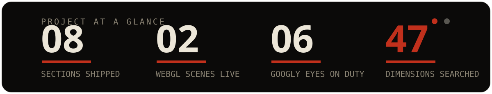

<div align="center">
  
</div>

<div align="center">

[](https://react.dev)
[](https://www.typescriptlang.org)
[](https://threejs.org)
[](https://gsap.com)
[](https://tailwindcss.com)
[](https://vitejs.dev)
[](https://workers.cloudflare.com)

**Portfolio of Prabin Wagle** — Computer Engineering student building intelligent systems at the intersection of AI, software, and real-world problems.

**Live:** `prabinwagle.com.np`

</div>

<div align="center">
  
</div>

## About

A single-page creative developer portfolio with an editorial ink-and-paper design language, Japanese typographic accents, a real-time WebGL hero sculpture, and scroll-driven storytelling across eight sections. Built with React, Three.js, and GSAP. Deployed on Cloudflare Workers.

## Features

- **Animated preloader** — ink counter, progress hairline, and curtain reveal
- **Interactive WebGL hero** — noise-displaced sculpture with fresnel and contour shading that reacts to cursor and scroll position
- **Scroll storytelling** — Lenis smooth scrolling with GSAP ScrollTrigger choreography and per-section light/dark theme transitions
- **Eight content sections** — Hero, About, Capabilities, Stack, Projects, AI Lab, Experiments, Philosophy, plus a Contact footer with validated form
- **Custom 404 experience** — animated Three.js scene with interactive elements, rotating messages, and a self-typing terminal
- **Subdomain handling** — unknown subdomains serve the custom 404 with a correct HTTP status via a Cloudflare Worker
- **Polish throughout** — custom cursor, magnetic buttons, film grain overlay, touch and reduced-motion fallbacks

<div align="center">
  
</div>

## Tech Stack

| Technology | Used for |
|---|---|
| React 19 + TypeScript | UI components and application logic |
| Three.js (R3F + Drei) | Hero sculpture and 404 scene rendering |
| GSAP + ScrollTrigger | Entrance and scroll-linked animation |
| Lenis | Smooth scrolling |
| Framer Motion | Menu and overlay transitions |
| Tailwind CSS v4 | Styling with theme-based design tokens |
| Cloudflare Workers | Hosting, subdomain guard, asset serving |
| Web3Forms | Contact form submissions |
| Vite | Build tooling (single-file production output) |

## The 404 Page

Unknown URLs render a dedicated animated scene instead of a dead end: two block "4"s flank a spinning red "0", each with eyes that follow the cursor. Clicking a digit (or the poke button) triggers a spin animation with escalating captions. Supporting elements include rotating status messages, a terminal-style log, and a keyboard shortcut (**B**) to return home.

| Route | Result |
|---|---|
| `/404`, `/404.html`, `/?404`, `/#/404`, any unknown path | Animated 404 experience |
| Any unknown subdomain, any path | Same 404 with real 404 HTTP status |

## Easter Eggs

- The poke button narrates itself across 6 escalating labels
- Press **B** anywhere in the 404 to go home
- 7 rotating status messages and a terminal log that types itself out
- Hidden details: seal stamp, ghost numerals, katakana marginalia, coordinate references

## Getting Started

```bash
npm install
npm run dev      # -> http://localhost:5173 (/404 previews the 404 page)
npm run build    # single-file production build into dist/
npm run preview
```

Copy `.env.example` to `.env` and set `VITE_WEB3FORMS_ACCESS_KEY` to enable the contact form.

## Project Structure

```
src/
  components/
    sections/     # Hero, About, Capabilities, Stack, Projects, AILab, ...
    three/        # InkSculpture (hero), LostInkScene (404)
    ui/           # Nav, Cursor, Preloader, Magnetic, ...
  lib/            # GSAP setup, Lenis, shared frame-loop state
  data/           # content.ts — all site copy in one place
  App.tsx         # app shell + lightweight unknown-route detection
  index.ts        # Cloudflare Worker: subdomain guard + asset serving
public/404.html   # standalone 404 fallback with its own Three.js scene
wrangler.toml     # Workers config: entry, assets, 404 handling, build
```

## Deployment

Cloudflare Workers Builds, framework preset **Vite** (`npm run build` → `dist`):

1. Connect the repository
2. Attach custom domains: apex + `www` + wildcard (`*.prabinwagle.com.np`)
3. Optional environment variables: `ALLOWED_SUBDOMAINS` (default `www`), `ZONE` (default `prabinwagle.com.np`)
4. Push to `main` — builds and deploys automatically

## Design Notes

Typography: **Anton** (display), **Bricolage Grotesque** (body), **Instrument Serif Italic** (accents), **IBM Plex Mono** (metadata), **Shippori Mincho** (Japanese). Palette: ink `#0b0a09`, ink-2 `#15130f`, paper `#ece6d8`, bone `#c9c1ae`, ash `#8b8474`, vermilion `#c1301c`.

---

<div align="center">

© 2026 Prabin Wagle · Computer Engineering · AI / ML · Software · Nepal

</div>
