<div align="center">
  
</div>

<div align="center">

[](https://react.dev)
[](https://www.typescriptlang.org)
[](https://threejs.org)
[](https://gsap.com)
[](https://tailwindcss.com)
[](https://vitejs.dev)
[](https://workers.cloudflare.com)

*A portfolio in three acts — ink, intelligence, and the void in between.*

**Live:** `prabinwagle.com.np` · **Get lost on purpose:** `/404`

</div>


## The Film

Most portfolios are slide decks with a contact form. This one is shot like a film: a **cold-open preloader** (ink counter, progress hairline, curtain lift), a **morphing WebGL ink sculpture** looming behind an editorial hero, and a scroll that crossfades the entire world between ink-black and paper-cream as acts change. Japanese marginalia, ghost numerals, diagram annotations — every frame is art-directed.

Running time: 8 sections + a finale. No intermission. Popcorn optional.

## Box Office

- **8 sections** — Hero · About · Capabilities · Stack · Projects · AI Lab · Experiments · Philosophy
- **2 WebGL scenes** — InkSculpture (hero) + LostInkScene (the void)
- **6 googly eyes** in the 404 — all of them judging you
- **47 dimensions** searched for every lost page. The page was in none of them
- **0 routers** — lost-route detection is ~10 lines of vanilla location sniffing
- **1** vermilion seal, pressed where it hurts

<div align="center">
  
</div>

## Cast & Crew

| Credit | Role |
|---|---|
| React 19 + TypeScript | The leads — continuity guaranteed |
| Three.js / R3F + Drei | The haunted dimension |
| GSAP + ScrollTrigger + SplitText | Choreography |
| Lenis | The glide (GSAP-ticker driven) |
| Framer Motion + anime.js | Curtains and chaos |
| Tailwind CSS v4 | Costume department (`@theme` ink/paper/shu) |
| Cloudflare Workers | The bouncer (subdomain guard + asset serving) |
| Web3Forms | The messenger (contact form) |

## Set Pieces

- **Cold open** — preloader counts in ink while the name registers, then the curtain lifts on cue
- **The sculpture** — noise-displaced icosahedron with fresnel + topographic contour shaders; dents under your cursor, spins harder as you scroll away
- **Theme flip** — ScrollTrigger repaints `--bg / --fg / --muted / --line` mid-scroll; the whole page crossfades like a scene change
- **Diagram language** — every capability ships with its own SVG diagram (graphs, matrices, lenses, orbits)
- **Finale** — contact footer with validated form, honeypot field, magnetic slide-fill buttons, and a 30vw ghost "PW"

## The Void (Act III)

The 404 is not an error page — it's a location. Two paper "4"s flank a spinning vermilion donut "0", all with **cursor-tracking googly eyes** (one 4 is drunk, with a lazy eye). Click a digit or hit **poke the void** and they do a full panic flip, with escalating commentary from *"the void felt that"* to *"certified void-botherer."* Around it: rotating excuses, a self-typing terminal whose LLM witness lied, and a **B key** that beams you home like a protagonist.

| Route | Destination |
|---|---|
| `/404`, `/404.html`, `/?404`, `/#/404`, any unknown path | The void (animated Three.js cut, or the standalone static take) |
| `random.prabinwagle.com.np` (any path) | The void, real 404 status, URL untouched |

## Easter Eggs (spoilers)

<details>
<summary>Click to ruin the surprise</summary>

- The poke button narrates your harassment with 6 escalating labels
- Press **B** anywhere in the void to beam home
- 7 rotating excuses, including *"404: the page achieved enlightenment and left the server"*
- The terminal's `locate lost-page --everywhere` checks behind the couch. Nah
- 迷 (lost child) seal stamped on the diorama, ghost `404` watermark, katakana marginalia
- The middle 0 is officially documented in-code as "the overachiever"
- Run `npm run dev` and open `/404` — the void previews locally with zero DNS required

</details>

<div align="center">
  
</div>

## Run It Locally

```bash
npm install
npm run dev      # -> http://localhost:5173  (/404 previews the void)
npm run build    # single-file production build into dist/
npm run preview
```

Copy `.env.example` to `.env` and set `VITE_WEB3FORMS_ACCESS_KEY` for the contact form.

## Project Structure

```
src/
  components/
    sections/     # Hero, About, Capabilities, Stack, Projects, AILab, ...
    three/        # InkSculpture, LostInkScene (the void)
    ui/           # Nav, Cursor, Preloader, Magnetic, ...
  lib/            # gsap setup, lenis, sceneState (frame-loop shared state)
  data/           # content.ts — all copy lives here
  App.tsx         # lightweight lost-route detection (no router)
  index.ts        # Worker entry: subdomain guard + asset serving
public/404.html   # standalone 404 fallback (own Three.js scene)
wrangler.toml     # run_worker_first, 404-page handling, build wiring
```

## Deployment (Cloudflare Workers Builds)

1. Connect the repo — framework preset **Vite** (`npm run build` → `dist`)
2. Custom domains: apex + `www` + **`*.prabinwagle.com.np`** (wildcard DNS + cert automatic)
3. Optional env vars: `ALLOWED_SUBDOMAINS` (default `www`), `ZONE` (default `prabinwagle.com.np`)
4. Push to `main` — deploys itself

## Colophon

Set in **Anton** (display), **Bricolage Grotesque** (text), **Instrument Serif Italic** (asides), **IBM Plex Mono** (metadata), **Shippori Mincho** (Japanese). Palette: ink `#0b0a09` · ink-2 `#15130f` · paper `#ece6d8` · bone `#c9c1ae` · ash `#8b8474` · shu vermilion `#c1301c`.

---

<div align="center">

© 2026 Prabin Wagle · Computer Engineering · AI / ML · Software · Nepal

深く学び、作り続け、全てを疑う — *learn deeply, keep building, question everything*

</div>
